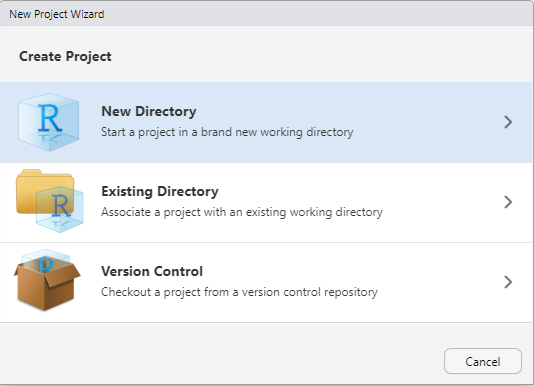
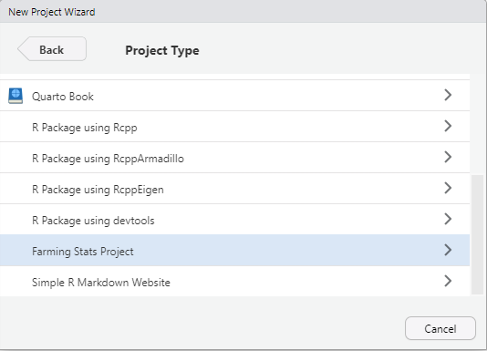
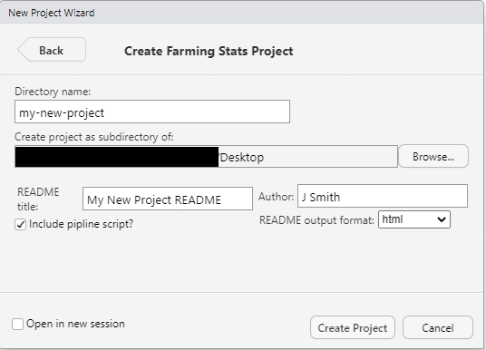
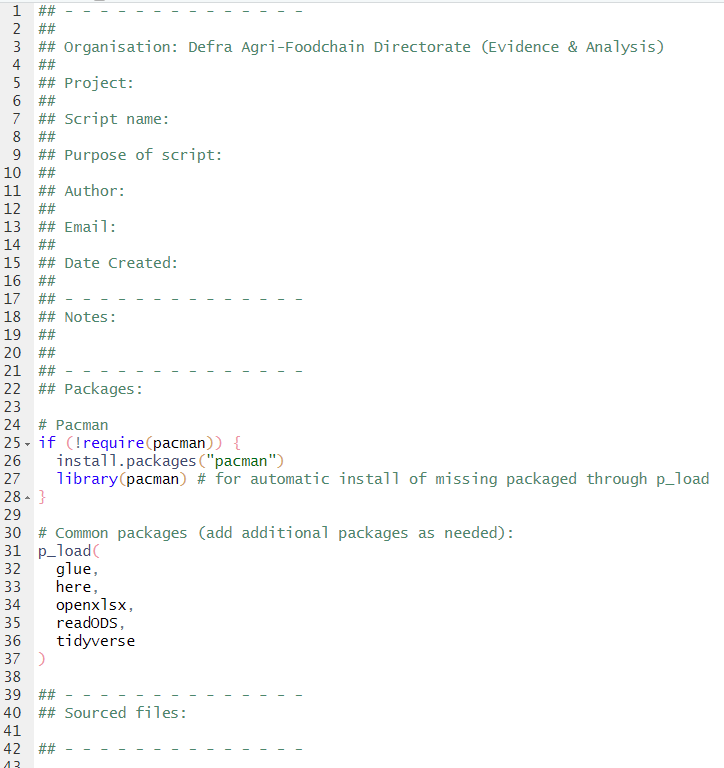
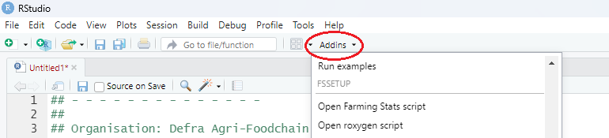

# fssetup
Josh Moatt
21/05/2025

- [Purpose](#purpose)
- [Installing `fssetup`](#installing-fssetup)
- [Key features](#key-features)
  - [Projects](#projects)
  - [Script templates](#script-templates)
  - [GitHub integration](#github-integration)
  - [Addins](#addins)
  - [DASH Unity Catalog](#dash-unity-catalog)
- [Feedback](#feedback)

<!-- badges: start -->

[](https://www.repostatus.org/#active)
[](https://CRAN.R-project.org/version/fssetup)

<!-- badges: end -->

## Purpose

The main aim of the `fssetup` package is to standardise how we use R and
encourage the use of coding best practice across the Farming Stats
teams. However, it also tries to make getting started working in R
simpler, for those who are less experienced in coding. The package
contains the functions needed to create various features in R using
Farming Stats team templates, including: scripts, projects, READMEs and
gitignores. It also contains useful functions for linking RStudio and
RStudio projects to GitHub. A recent update is the inclusion of some
helpful tools for working with the DASH Unity Catalog (e.g. pulling and
saving data). We describe the key features and how bet to use them in
more detail below.

## Installing `fssetup`

``` r
devtools::install_github("Defra-Data-Science-Centre-of-Excellence/fssetup")
```

Alternatively, you can download a .zip copy of this repo and install it
using this:

``` r
install.packages(
  "~/Downloads/fssetup.zip",
  repos = NULL
)
```

## Key features

### Projects

R projects should be the default way of working for any work undertaken
in R. To standardise how we set out and use projects, this package
`fssetup` will install a package template into your RStudio IDE. You can
access this through the new project window in RStudio by going to File
-\> New Project… Alternatively, you can access the new project window
through the projects dropdown at the top right of the RStudio window.

#### The project template

A project created using this template will have the skeleton of a R
project for you. The template looks like this:

- **data** - this is where you should store your data (unless it is
  stored securely elsewhere).

- **src** - this is where any material you source in (e.g. scripts,
  functions, rmds, etc) should be stored.

- **outputs** - where any outputs should be saved to (e.g. svgs, ods,
  text files, etc)

- **README** - two files for your README will be added, a quarto (.qmd)
  file where you can create your README, and the output of your README.
  This will either be a .html or .md file depending on what option you
  choose (see below).

- **pipeline** - if selected in the options (see below) and initial
  pipeline script will be added, this should be the master script which
  executes your project. You can source all other material (scripts,
  rmds etc) into this script to be executed.

#### Starting a new project

1.  Go to File -\> New Project…
2.  The new project window should open, here select “New Directory”:



3.  On the next pane, scroll down and select “Farming Stats Project”



4.  The next pane will ask for some details. Fill in the details (see
    below) and then click “Create Project”.  
      
    The details required are:
    - Directory name - this will be the project and folder name. This
      should follow best practice (e.g. “my_new_project” or
      “my-new-project”).

    - Create project as a sub-directory of - use this to specify where
      the project should be saved.

    - README title - the title for your README. If blank, this will be
      auto-populated.

    - Author - your name or initials.

    - Include pipe script - this will include an initial R script within
      the directory using the `fssetup` script template (see below).

    - README output format - what format your README will take. Default
      is HTML but can also be GitHub or markdown.



5.  Once you click create project, the new project will be created using
    the Farming Stats template and RStudio will change to this project.

<div>

> **Warning**
>
> Sometimes this function fails on the Defra install of RStudio. This
> seems to be an issue with how RStudio was packaged by Defra. It has no
> issues working on the DASH Platform.

</div>

### Script templates

An often overlooked aspect of coding best practice, is including a
header for your scripts. This should include all the metadata needed for
someone else to pick up you script, and understand what it is doing and
why.

The `fssetup` package includes the `create_fs_script_template` function
that will allow you to set a predefined template script, that all new
scripts will open with. The function also has options for making
customised templates, manually editing the template, and removing the
existing template.

#### Adding the default script template

The `create_fs_script_template` comes pre-loaded with a suggested
farming stats script template (see below). To add this simply run the
following code in the console:

``` r
fssetup::create_fs_script_template(format = "farming_stats")
```

From now on, every script you open will have the farming stats script
header:



### GitHub integration

Using version control is an essential part of coding best practice and
Reproducible Analytical Pipelines. GitHub is one of the most common
version control tools. Learning to work with GitHub can be a bit
daunting if you are new to it, but it is strongly recommended that you
do and you will soon learn to love it.

The `fssetup` package has a number of useful functions to help you get
started working with GitHub.

#### Setting your GitHub credentials and SSH key

On the DASH platform, it is recommended that you connect the RStudio
server with your GitHub account via SSH. There is a step by step guide
of how to so this in the [DASH
Playbook](https://dap-prd2-connect.azure.defra.cloud/DASH-Playbook/rstudio.html#rstudio-github).
However, this involves multiple steps and interacting with the terminal.
he `fssetup` package include a simple function to do the heavy lifting
for you.

##### Using the function

1.  If not installed already, install `fssetup` on the RStudio server.

2.  Run the function as follows:

<!-- -->

    fssetup::fs_connect_ssh(
      username = "your-github-username",
      email = "your-email@defra.gov.uk"
    )

3.  A console message will appear asking you to confirm you have added
    you SSH key to GitHub. Copy the SSH key that has been printed in the
    console.

4.  In a new window or tab, go to GitHub -\> Settings -\> SSH and GPG
    keys.

5.  Click “New SSH key”.

6.  Add a title into the “Title” box and then paste SSH key in the “Key”
    box. Then click “Add SSH key”.

7.  Return to RStudio server and respond “y” to the console prompt. The
    function will now finish setting everything up. Once complete, you
    will see the following printed in the console: “Hi username! You’ve
    successfully authenticated, but GitHub does not provide shell
    access”.

#### Setting your GitHub credentials and Personal Access Token.

To use GitHub, you must link your local RStudio istall with GitHub.
There is a step by step guide of how to do this on the Defra sharepoint
[here](https://defra.sharepoint.com/:w:/r/sites/Community448/_layouts/15/Doc.aspx?sourcedoc=%7B954065A9-5C68-4351-B42E-872220CDFCA6%7D&file=Linking%20your%20local%20RStudio%20to%20git%20and%20github%20-%20updated.docx&action=default&mobileredirect=true).
However, this can be a bit off putting as it requires users to interact
with the command line via the terminal. So the `fssetup` package include
a handy function to do all the hard work for you.

#### Using the function:

1.  Using the [Defra sharepoint
    guide](https://defra.sharepoint.com/:w:/r/sites/Community448/_layouts/15/Doc.aspx?sourcedoc=%7B954065A9-5C68-4351-B42E-872220CDFCA6%7D&file=Linking%20your%20local%20RStudio%20to%20git%20and%20github%20-%20updated.docx&action=default&mobileredirect=true)
    generate you PAT and copy it. Keep it somewhere to hand.
2.  Then Simply run the following code:

``` r
fssetup::fs_connect_github(
  username = "your-github-username",
  email = "your-email@defra.gov.uk"
)
```

3.  In the console a prompt *may* appear asking you if you would like to
    update your credentials. Choose the option to replace the
    credentials. If this prompt doesn’t appear, skip to the next step.
4.  You will then be prompted to paste in your PAT. Do so and hit enter.
5.  Your RStudio and GitHub accounts will now be linked!

<div>

> **Tip**
>
> It is recommended that you change you PAT every 30 days. You can use
> this function to update your PAT each time.

</div>

#### Creating a GitHub repo for an existing R project.

As mentioned above, version control is essential to best practice. The
key step in this is to create a GitHub repository (or repo) to store all
the code for your project in. This has a huge number of benefits (just
have a google to find out more). But the steps involved in setting up a
repo and integrating it into you R project can again be daunting to
those new to Git.

Again, `fssetup` has simplified the process. Simply do the following.

1.  Open the project you want to connect to git.
2.  Run the following code:

``` r
fssetup::fs_use_github()
```

3.  A lot of text will cycle through the console, telling you what it is
    doing as it progresses through the rep set up (you can ignore most
    of this).

4.  At some point, your browser will open and show you your new GitHub
    repo

    <div>

    > **Tip**
    >
    > Sometimes, the browser window shows a page not found error, simply
    > refresh the page and your repo will appear.

    </div>

5.  You will also get an RStudio prompt telling you that RStudio needs
    to restart - this is perfectly normal and is to allow RStudio to
    initialise the Git pane in the RStudio interface.

6.  Once RStudio has restarted, you’re good to go.

    <div>

    > **Tip**
    >
    > The best time to run this function is when you initially set up
    > your project

    </div>

This function will have:

- Created a GitHub repo with the name of your project and do all the
  initialisation and set up needed. The default is to create a private
  repo, that is only visible to you.

- Add a gitignore to you project - this will include some a basic files
  and file types to ignore.

- Perform an initial commit and add all your existing project files to
  the GtiHub repo.

<div>

> **Warning**
>
> Ensure no sensitive data is in your project when you run this function
> or it could be pushed to GutHub. If working with sensitive data after
> set up, ensure to add your data files to the gitignore.

</div>

<div>

> **Caution**
>
> On very rare occasions this function fails to set the master branch
> and users are unable to push changes. If this happens try running
> \`git push -u origin
> master`in the terminal, this should set you current branch as the master. We're not sure why this happens, but it is advisable to use`fs_connect_github
> to set your credentials properly before trying this function.

</div>

### Addins

The final tool included in `fssetup` are two addins. These open scripts
with predefined templates.

“Open Farming Stats script” - this just opens a script with the Farming
Stats template. If you’ve used the `create_fs_script_template` function
(described above) and used a custom template, this addin could be useful
for adding the standard Farming Stats template if need alongside your
custom template.

“Open roxygen script” - this opens a script with a generic roxygen2 set
of comments ready for you to complete. Mainly this is useful if you are
creating your own package!

<div>

> **Tip**
>
> Even if you are not going the whole way and creating a package, adding
> roxygen comments to the top of any functions you create can be a good
> idea. Firstly, it helps you keep track of what the function is doing
> (very helpful if you come back to a project after some time). but
> also, it saves time if you did ever decide to package your functions -
> as a lot of the work will be done for you.

</div>

To access these addins:

1.  Go to the Addins dropdown in the toolbar.
2.  Scroll down to the `fssetup` subheading.
3.  Click your addin.



### DASH Unity Catalog

The DASH platform is the new data analytics platform in Defra. It is
built using Microsoft databricks. It is a really useful tool and could
be how we conduct analyses in the future. Currently the DASH Unity
Catalog (UC), which is used for restricted data and RStudio server,
where we carry out analyses, cannot directly interact. So you must
interact with the databricks API and copy data from DASH UC to the
RStudio server. This package includes some simple functions to read data
from UC into RStudio cluster on databricks.

Note, you must have set up a databricks PAT in the databricks settings
before doing this.

More to follow.

## Feedback

As mentioned, the `fssetup` package aims to help standardise the use of
R across Farming Stats and make R easier to use for people newer to
coding. It is still very much a package in development, so we would
welcome any and all feedback. We are particularly interested to hear of
any functions you would like to see added, or any process in getting
started in R that you struggle with, as we might be able to incorporate
these into future versions.

Feedback can be sent in a number of ways:

- Email the EDIT team at <AUK_stats_team@defra.gov.uk>

- Email me directly at <joshua.moatt@defra.gov.uk>

- or via GitHub
